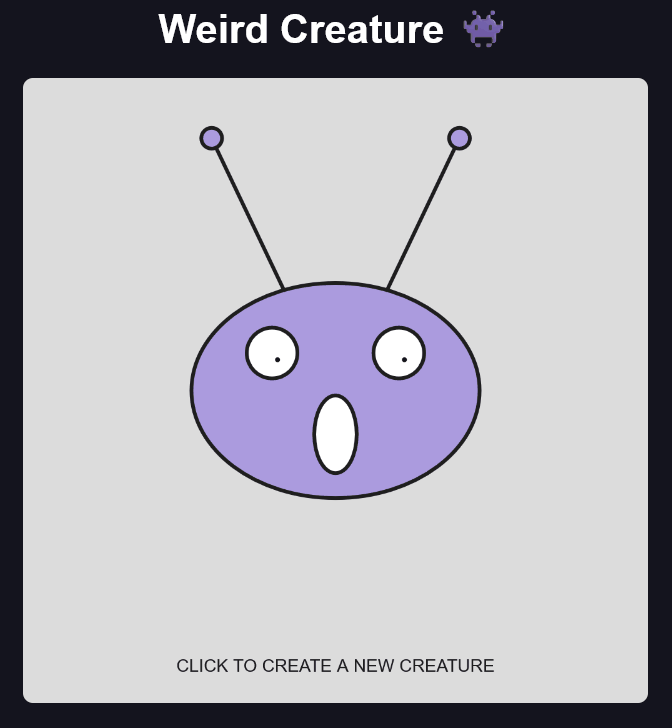

# Weird Creature 👾

An interactive creature generator built with p5.js.

Each click creates a new randomized creature with different body proportions, colors, eye sizes, mouth width and antenna traits. The eyes follow the mouse, while the mouth changes expression based on vertical mouse movement.

## Controls

- **Move mouse** → Eyes follow the cursor
- **Move mouse vertically** → Mouth expression changes
- **Click** → Generate a new creature

## Concepts

- Objects and state
- Randomized traits
- Mouse interaction
- `map()` and value mapping
- Relative coordinates
- Functions
- `push()` / `pop()`
- Procedural character generation

## Built with

- p5.js
