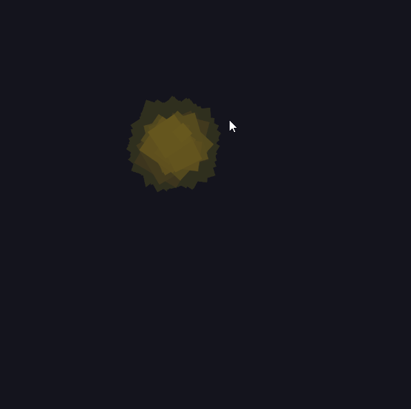
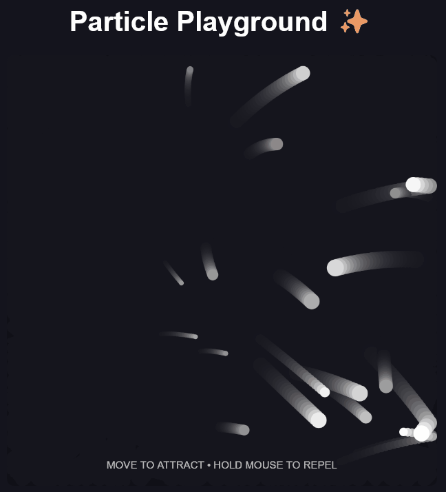

### 01 — Magic Paint 🎨

An interactive generative drawing experiment where mouse movement controls color and size, while randomness creates expressive brush strokes.

**Features**
- Mouse-controlled generative painting
- Speed-based color
- Randomized size, position and rotation
- Multiple shape modes
- Explosion interaction
- Trail effect
- Keyboard controls

[▶ Play Magic Paint](https://lberou.github.io/creative-coding-portfolio/01-magic-paint/)

[View source in p5.js Editor](https://editor.p5js.org/lberou/sketches/2t5Csw23n)

---

### 02 — Weird Creature 👾

An interactive creature generator where each click creates a new randomized character, while the eyes and mouth react to mouse movement.

**Features**
- Randomized creature traits
- Mouse-following eyes
- Interactive mouth expressions
- Procedural body proportions and colors
- Responsive antenna placement
- Object-based state

[▶ Play Weird Creature](https://lberou.github.io/creative-coding-portfolio/02-weird-creature/)

---

### 03 — Particle Playground ✨

An interactive particle system where particles respond to mouse attraction and repulsion, bounce off boundaries and change brightness based on their speed.

**Features**
- Mouse attraction
- Click-and-hold repulsion
- Independent particle movement
- Velocity and acceleration
- Speed-based brightness
- Boundary collisions
- Subtle motion trails
- Modular particle behavior

[▶ Play Particle Playground](https://lberou.github.io/creative-coding-portfolio/03-particle-playground/)
